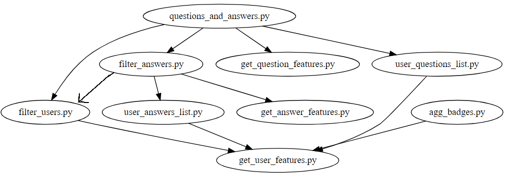

# User Credibility Stack Overflow Features
<!-- 
http://www.webgraphviz.com/
digraph G {
  "questions_and_answers.py" -> "filter_users.py"
  "questions_and_answers.py" -> "filter_answers.py"
  "questions_and_answers.py" -> "get_question_features.py"
  "filter_answers.py" -> "user_answers_list.py"
  "questions_and_answers.py" -> "user_questions_list.py"
  "filter_answers.py" -> "get_answer_features.py"
  "user_questions_list.py" -> "get_user_features.py"
  "user_answers_list.py" -> "get_user_features.py"
  "agg_badges.py" -> "get_user_features.py"
  "filter_users.py" -> "get_user_features.py"
}
-->

Each Python2 script reads from one or multiple files and 
writes to one or more files in a given directory. For every script, the 
directory should be specified using the first command line
argument for the corresponding python script. The image 
represents the script dependency graph. A parent script 
should be run before a child so that the necessary prerequisite files
are already in the directory. To begin, Badges.xml, Posts.xml 
and Users.xml should already be in the directory.

To extract Stack Exchange data
./Extract.sh path-to-datfolder
